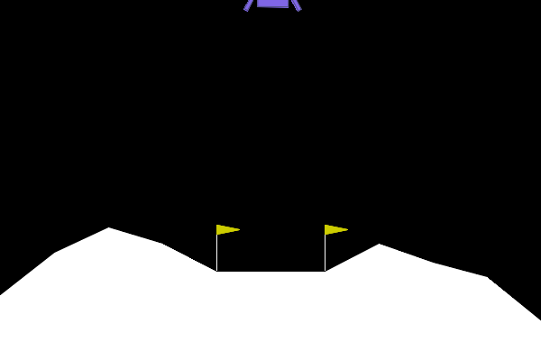

# DQN Agent for LunarLander-v2 using PyTorch




This project implements a Deep Q-Network (DQN) agent to solve the `LunarLander-v2` environment from the [Gymnasium](https://gymnasium.farama.org/) library. The agent is built using PyTorch.

## Features

* **Deep Q-Network (DQN):** A neural network approximates the Q-values.
* **Experience Replay:** Stores experiences (state, action, reward, next_state, done) in a replay buffer to break correlations and improve learning stability.
* **Epsilon-Greedy Exploration:** Balances exploration of new actions with exploitation of known good actions. Epsilon decays over time.
* **Periodic Evaluation:** The agent's performance is evaluated periodically on a set number of episodes without exploration.
* **Early Stopping:** Training can stop early if the agent achieves a target average score during periodic evaluations.
* **Model Persistence:** The trained model weights can be saved and loaded.
* **Progress Visualization:** Training progress (scores per episode, evaluation scores) is plotted and saved as an image.
* **Results Logging:** Detailed training statistics (episode number, training reward, average loss, approximate epsilon, evaluation score) are saved to a CSV file.
* **Configurable Hyperparameters:** Key parameters like network architecture, learning rate, batch size, and evaluation frequency can be adjusted in the script.

## Requirements

* Python 3.8+
* PyTorch
* Gymnasium (with Box2D)
* NumPy
* Pandas
* Matplotlib

You can install the necessary packages using pip:
```shell
pip install torch gymnasium[box2d] numpy pandas matplotlib
